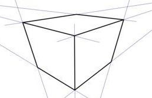
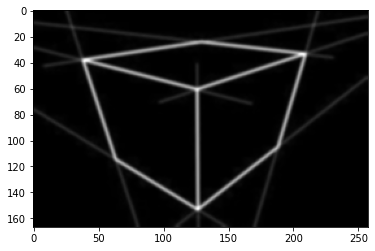
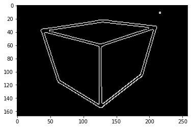
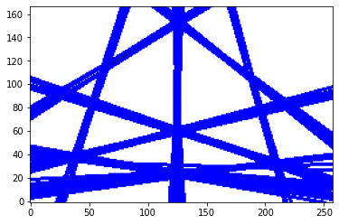
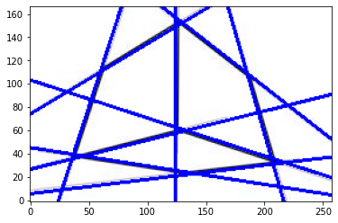
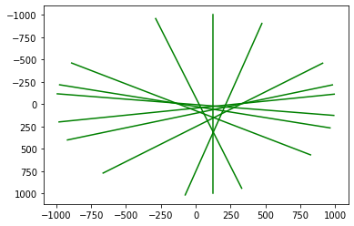
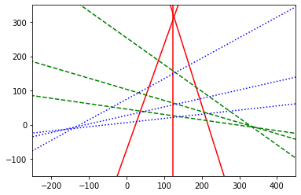

# Drawabox
---

  * Objectives :
  
    1. Detect the vanishing points of Hand-drawn cubes.
    2. Compare the real vanishing points with the handrawn vanishing lines.
    3. Provide Illustration of the Error.
    4. 
---
  * Tools:
  
    1. Python
    2. Computer Vision algorithms
    3. ML algorithm (LR)
    4. Matplotlib
    5. 3D geometry
    6. Opencv 
---
The purpose of this application is to help people who are trying to learn consruction(Drawing) understand how much their cube is skewed.
---

Original Image           |  Grayscale           |   Gaussian Blur
:-------------------------:|:-------------------------:|:-------------------------:
  |    |  

Canny Edge Detection      |  HoughLine Transform     |   Filtering detected lines based on proximity
:-------------------------:|:-------------------------:|:-------------------------:
  |    |  

Plotting intersections    |  Grouping Lines based on vanishing points             
:-------------------------:|:-------------------------:
  |    
